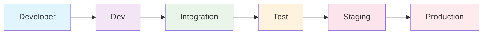

# Software Development Environments

Different environments are used throughout the software development lifecycle to test and deploy applications safely.

## Environment Types

### 1. Development (dev)

**Purpose**: Developer's local machine for writing and testing code
**When to use**:

- Writing new features
- Fixing bugs
- Local testing
  **Example**: `npm run dev` on localhost:3000

### 2. Integration (int)

**Purpose**: Shared environment where team code changes are combined
**When to use**:

- Testing how different features work together
- Validating API connections
- Team collaboration
  **Example**: Auto-deploys when code is merged to develop branch

### 3. Test

**Purpose**: Dedicated environment for quality assurance testing
**When to use**:

- Manual testing by QA team
- Running automated test suites
- Performance testing
  **Example**: Stable environment with production-like data (anonymized)

### 4. Staging (stage)

**Purpose**: Pre-production environment that mimics production
**When to use**:

- Final testing before going live
- Showing features to stakeholders
- Production deployment practice
  **Example**: Production-like setup with real data (anonymized)

### 5. Production (prod)

**Purpose**: Live environment serving real users
**When to use**:

- Serving actual customers
- Business operations
- Revenue generation
  **Example**: Live website with real user data and full monitoring

## Environment Flow

## Key Differences

| Environment | Data Type       | Security   | Access    | Purpose                   |
| ----------- | --------------- | ---------- | --------- | ------------------------- |
| Dev         | Mock/Synthetic  | Low        | Developer | Code development          |
| Int         | Anonymized      | Low-Medium | Team      | Integration testing       |
| Test        | Anonymized      | Medium     | QA Team   | Quality assurance         |
| Stage       | Production-like | High       | Limited   | Pre-production validation |
| Prod        | Real data       | Highest    | Strict    | Live operations           |
