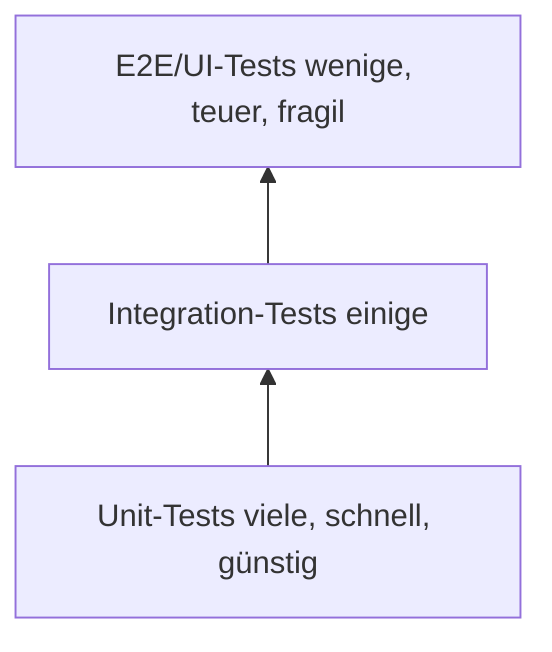

## Spick – Software Testing (kurz & anfängerfreundlich)

Ziel: In 5–10 Minuten die wichtigsten Begriffe verstehen und Beispiele parat haben.

---

### 1) Einführung ins Testing

- **Warum testen?** Risiken senken, Vertrauen schaffen, Qualität sichern, Kosten früh abfangen.
- **Eigenschaften von Tests**
  - Tests zeigen Fehler – sie beweisen nicht, dass keine existieren.
  - Frühes Testen spart Geld (Fehler kosten später mehr).
  - Kontextabhängig: Was, wie viel und wie testen hängt vom Produkt und Risiko ab.
- **Testing Mindset**
  - Neugierig, kritisch, systematisch. Stelle Annahmen in Frage.
  - Risikobasiert priorisieren: Was tut am meisten weh, wenn es kaputt ist?
  - „Shift‑Left“: So früh wie möglich testen (z. B. Unit‑Tests, statische Checks).

---

### 2) Testpyramide (welche Tests wie viele?)

Viele schnelle Unit‑Tests, weniger Integration, wenige teure E2E.



- **Faustregel**: Baue den Großteil unten (Unit), stütze in der Mitte (Integration), prüfe das Wichtigste oben (E2E).

---

### 3) Teststufen – Ziel & Beispiel

- **Unit‑Test**: Kleinste Einheit in Isolation (Funktion/Klasse).
  - Beispiel: `sum(2,2)` liefert `4`; Datenbank wird gemockt.
- **Integration‑Test**: Zusammenspiel mehrerer Einheiten/Services.
  - Beispiel: API‑Endpoint schreibt wirklich in die DB und liefert eine neue `id` zurück.
- **System‑Test**: Gesamtsystem gegen Anforderungen (Black‑Box möglich).
  - Beispiel: Nutzer:in registriert sich, loggt ein, legt Workout an – kompletter Flow funktioniert.
- **Akzeptanz‑/Acceptance‑Test (UAT)**: Fachseite/Stakeholder prüft, ob das Produkt für den Einsatz taugt.
  - Beispiel: Product Owner prüft „Export als CSV“ gemäß Akzeptanzkriterien.

Hinweis (Begriffe nach ISTQB‑Glosar): „Test levels“ = Unit/Component, Integration, System, Acceptance.

---

### 4) Testmethoden (Box‑Modelle)

- **Black‑Box**: Nur Inputs/Outputs und Spezifikation; intern egal.
  - Beispiel: Passwort‑Reset akzeptiert valide E‑Mail, schickt Token; interne Implementierung egal.
- **White‑Box**: Interne Struktur/Code ist bekannt; Kontrollfluss, Zweige, Pfade werden gezielt abgedeckt.
  - Beispiel: Jede `if/else`‑Verzweigung wird mindestens einmal durchlaufen.
- **Grey‑Box**: Teilkenntnis (z. B. Datenbank‑Schema bekannt), testet aber über öffentliche Schnittstellen.

---

### 5) Weitere wichtige Testarten – kurz + Beispiel

- **Smoke/Sanity**: Schnelltest „lebt das System?“
  - Beispiel: App startet, Login‑Maske lädt, Health‑Endpoint 200.
- **Regression**: Prüft, dass Änderungen nichts Bestehendes kaputt machen.
  - Beispiel: Nach neuem „Workout‑Export“ funktionieren Anlegen/Anzeigen weiter.
- **Performance**: Antwortzeit, Durchsatz, Ressourcennutzung.
  - Beispiel: 95% der API‑Antworten < 500 ms bei N gleichzeitigen Nutzer:innen.
- **Usability**: Verständlichkeit/Bedienbarkeit für Menschen.
  - Beispiel: Nutzer:innen finden „Workout hinzufügen“ ohne Anleitung in < 10s.
- **Accessibility (A11y)**: Barrierefreiheit nach WCAG (z. B. Screenreader, Kontrast).
  - Beispiel: Alle Form‑Felder haben Labels, Kontrast‑Ratio ≥ 4.5:1.
- **Security**: Schwachstellen (z. B. OWASP Top 10) vermeiden.
  - Beispiel: SQL‑Injection verhindert, Passwörter gehasht, Rate‑Limiting aktiv.
- **Alpha/Beta**: Vorabtests
  - Alpha: intern beim Hersteller
  - Beta: extern mit ausgewählten Nutzer:innen im echten Umfeld

---

### 6) Umgebungen (Environments)

**Ziele**: Risiko trennen, reproduzierbar testen, sichere Daten/Secrets, „prod‑nah“ vor Live‑Gang.

```mermaid
flowchart LR
  DEV[DEV (lokal)] --> INT[INT (Integration, gemeinsam)] --> TEST[TEST (stabil für QA/CI)] --> STAGE[STAGE (prod-ähnlich)] --> PROD[PROD (live)]
```

- **Isolation/Parität**
  - Getrennte Datenbanken/Secrets; Seed‑/Testdaten statt Produktivdaten.
  - Möglichst ähnliche Konfiguration wie PROD ("prod‑parity").
- **Kurzbeschreibung**
  - DEV: lokal, Hot‑Reload, viele Mocks erlaubt.
  - INT: Dienste treffen zusammen; kann wackeln, gut für Integrationsfehler.
  - TEST: stabil, automatisierte Tests laufen hier; kontrollierte Testdaten.
  - STAGE/Pre‑Prod: PROD‑ähnlich; letzte Checks, Performance, Freigabe.
  - PROD: Kund:innen‑System, Monitoring/Alarmierung wichtig.

---

### 7) Testkonzept – was gehört rein? (Kurzform)

Nutzen: Gemeinsames Verständnis, Fokus auf Risiko, planbares Testen.

- Ziele und Scope (in/out)
- Teststrategie und Stufen (Pyramide, welche Tests wo?)
- Testobjekte (Funktionen, Schnittstellen, Risiken)
- Abdeckung/Matrix (Ziele × Testfälle, Priorität)
- Rahmen: Ressourcen, Rollen, Schweregrade, Pass/Fail‑Regeln, Entry/Exit‑Kriterien
- Umgebung, Testdaten, Hilfsmittel/Tools, CI/CD‑Integration
- Repräsentative Testfälle (kurz beschrieben: Voraussetzung → Schritte → erwartetes Ergebnis)
- Plan/Timing/Reporting (z. B. Abnahmetermine, Metriken)

Mini‑Beispiel Testfall (Schablone):

```
Ziel: Workout anlegen (glücklich)
Voraussetzungen: Nutzer:in eingeloggt
Schritte: „Neu“ → Name „Pull Day“ → Speichern
Erwartet: Erfolgsmeldung, Eintrag sichtbar, DB‑Datensatz vorhanden
```

---

### 8) Quick‑Checks (wenn wenig Zeit ist)

- Kritische Pfade funktionieren? (Login, Kauf/Save, Export)
- Happy‑Paths + 1–2 wichtige Fehlerfälle pro Feature
- Regression: wichtigste Alt‑Funktionen klicken
- A11y‑Basics: Labels, Kontrast, Tastatur‑Nutzung möglich
- Security‑Basics: Auth, Rollen, Eingaben validiert, keine Secrets im Client

---

### Quellen (für Vertiefung)

- ISTQB Glossary – Test Levels, Methoden
  - [ISTQB Glossary – Test Levels](https://glossary.istqb.org)
- Testpyramide
  - [Martin Fowler – The Practical Test Pyramid](https://martinfowler.com/articles/practical-test-pyramid.html)
- Accessibility
  - [W3C – WCAG Quick Reference](https://www.w3.org/WAI/standards-guidelines/wcag/)
- Security
  - [OWASP – Top 10](https://owasp.org/www-project-top-ten/)
