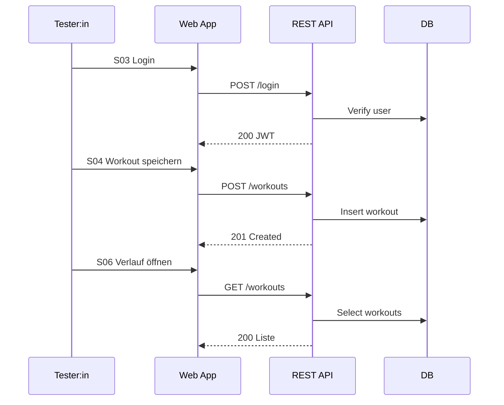

# Testkonzept – Workout Tracker

> Referenzen: HERMES (Ergebnis «Testkonzept») und ISO/IEC/IEEE 29119 (Nachfolger von IEEE 829)

## Titel / Einleitung

- Projektname: Workout Tracker
- Autor:innen: Team QA / Development
- Kontakt: qa@example.org
- Version: 0.1 (Entwurf)
- Kurzbeschreibung: Web‑App zur Planung, Erfassung und Auswertung von Workouts. Kontext siehe `03/aufgabe1-beschreibung.md`.

## Testziele (nummeriert)

1. Funktionale Kernabläufe sind korrekt (Registrierung, Login, Workout anlegen/bearbeiten/löschen).
2. Datenpersistenz ist zuverlässig (Speichern, Abrufen, Konsistenz der Entitäten User/Workout/Exercise/Set).
3. Zugriffsschutz ist gewährleistet (nur eigene Daten sichtbar, Sessions/JWT valide).
4. Basis‑Usability auf Mobil/Desktop ist gegeben (kritische Flows ohne Blocker nutzbar).
5. Einfache Analytics/Verlauf sind korrekt (Aggregationen, PB‑Erkennung, Filterung).
6. Export liefert vollständige, korrekt formatierte Daten (CSV/JSON, Zeichensatz/Trennzeichen korrekt).

## Teststrategie und Teststufen

- Strategien: Mischung aus manuellen Black‑Box‑Systemtests, API‑Integrationstests und automatisierten Unit‑/Component‑Tests.
- Stufen:
  - Unit‑Tests (Domain/Utils)
  - Component/UI‑Tests (z.B. mit Playwright/Testing Library)
  - API‑Integrationstests (gegen Test‑DB)
  - Systemtests End‑to‑End (kritische Flows manuell + selektiv automatisiert)
- Fokussierung: Auth, Workout‑CRUD und Datenkonsistenz (höchstes Risiko/Business‑Impact).

## Testobjekte

- Frontend Web‑App (Screens: Login/Registration, Log Workout, History, Analytics, Export)
- Backend REST‑API (Auth, Workouts, Exercises, Sets, Export)
- Datenbank (PostgreSQL) – Migrations/Constraints/Seed‑Daten
- E‑Mail/Notification (optional)

## Testabdeckung

- In‑Scope: Kernflüsse (T1–T6), Fehlerpfade (z.B. Validierung), Rechte/Isolation, einfache Performance‑Checks.
- Out‑of‑Scope: Last‑/Stresstests, Accessibility‑Audit nach WCAG AA (nur Smoke), komplexe Trainer‑Funktionen.

| Ziel | S01 | S02 | S03 | S04 | S05 | S06 | S07 | S08 |
| ---- | --- | --- | --- | --- | --- | --- | --- | --- |
| T1   | X   | X   |     |     |     |     |     |     |
| T2   |     |     | X   | X   |     |     |     |     |
| T3   |     |     |     | X   |     |     | X   |     |
| T4   |     |     |     |     | X   |     |     |     |
| T5   |     |     |     |     |     | X   |     |     |
| T6   |     |     |     |     |     |     |     | X   |

Legende: S01–S08 referenzieren Szenarien in «Testfallbeschreibungen».

## Testrahmen

- Ressourcen: 1–2 QA, 1 Dev im Pairing für Fixes, 0.5 DevOps für Umgebung
- Zeit: 2–3 Tage für initiale Testdurchführung und Stabilisierung
- Pass/Fail‑Kriterien: Szenario besteht, wenn alle Then‑Erwartungen erfüllt und keine Blocker‑Fehler auftreten.
- Schweregrade: Blocker, Hoch, Mittel, Niedrig
- Entry: Testumgebung betriebsbereit, Migrationen ausgeführt, Seed‑Daten vorhanden
- Exit: Kritische Szenarien (S01–S06) bestanden, keine Blocker/Hoch offen, bekannte Mittel/Niedrig dokumentiert

## Testumgebung

- Testsystem: Staging/Test mit eigener DB‑Instanz, isolierte Testkonten
- Browser: Aktuelle Chrome/Firefox/Safari, iOS Safari (Smoke)
- Daten: Definierte Seed‑Daten + gezielte Edge‑Fälle (lange Namen, Sonderzeichen)

## Testfallbeschreibungen (Gherkin)

```gherkin
Feature: Registrierung & Login
  Background:
    Given der Server läuft und die Testdatenbank ist leer

  Scenario: S01 – Erfolgreiche Registrierung
    Given ich befinde mich auf der Registrierungsseite
    When ich gültige Daten eingebe
    And ich das Formular absende
    Then erhalte ich eine Bestätigung
    And ich werde zur Login-Seite weitergeleitet

  Scenario: S02 – Registrierung mit bestehender E-Mail
    Given ich befinde mich auf der Registrierungsseite
    When ich eine bereits registrierte E-Mail angebe
    And ich das Formular absende
    Then sehe ich die Fehlermeldung "E-Mail bereits vergeben"

  Scenario: S03 – Erfolgreiches Login
    Given ein registrierter Benutzer existiert
    When ich korrekte Zugangsdaten eingebe
    Then werde ich zum Dashboard weitergeleitet
```

```gherkin
Feature: Workout erfassen
  Background:
    Given ich bin als Benutzer eingeloggt

  Scenario: S04 – Neues Workout anlegen
    Given ich befinde mich auf der Seite "Workout erfassen"
    When ich gültige Workout-Daten eingebe
    And ich auf "Speichern" klicke
    Then wird das Workout gespeichert
    And es erscheint in meiner Verlaufsliste

  Scenario: S05 – Validierungsfehler beim Erfassen
    Given ich befinde mich auf der Seite "Workout erfassen"
    When ich das Formular ohne Pflichtangaben absende
    Then sehe ich die Fehlermeldung "Bitte Pflichtfelder ausfüllen"
```

```gherkin
Feature: Verlauf, Analytics und Export
  Background:
    Given ich bin als Benutzer eingeloggt und es existieren Workouts

  Scenario: S06 – Verlauf anzeigen
    When ich zur Seite "Verlauf" navigiere
    Then sehe ich eine Liste meiner Workouts

  Scenario: S07 – Zugriffsschutz (Isolation)
    Given es existieren Workouts eines anderen Benutzers
    When ich dessen Workout-ID direkt aufrufe
    Then erhalte ich einen 403/404 und sehe keine fremden Daten

  Scenario: S08 – Export CSV
    When ich den CSV-Export starte
    Then erhalte ich eine CSV-Datei mit allen Feldern in UTF-8
```

## Testplan (Ablauf)

- Reihenfolge (happy paths zuerst): Registrierung/Login → Workout‑CRUD → Verlauf → Export → Negativpfade
- Regression: Kernpfade S01, S03, S04, S06 als „Smoke Suite“ bei jeder Änderung
- Automatisierung: Unit/Integration in CI, ausgewählte E2E (S03, S04, S06)



## Testorganisation und Zuständigkeiten

- QA: Planung, Durchführung, Defektmanagement
- Dev: Fehleranalyse/Fixes, Unterstützung bei Testdaten/Instrumentation
- DevOps: Umgebung/Deployments/Backups
- Abhängigkeiten: Auth muss funktionsfähig sein, bevor CRUD‑Tests sinnvoll möglich sind

## Testinfrastruktur

- Testsystem: Staging/Test mit separater DB
- Testdaten: Seed‑Skripte plus Fixtures für Edge‑Fälle
- Testhilfsmittel: CI (z.B. GitHub Actions), Node.js, Playwright/Postman, pgAdmin


